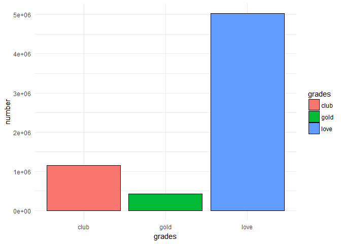
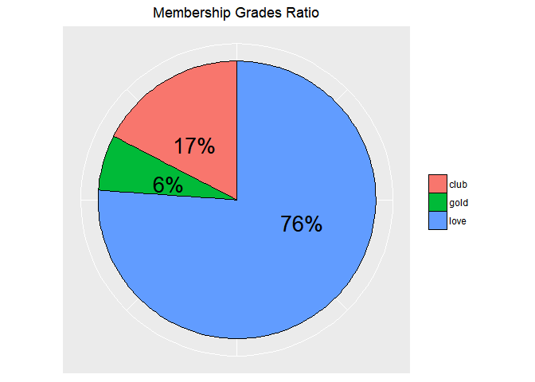
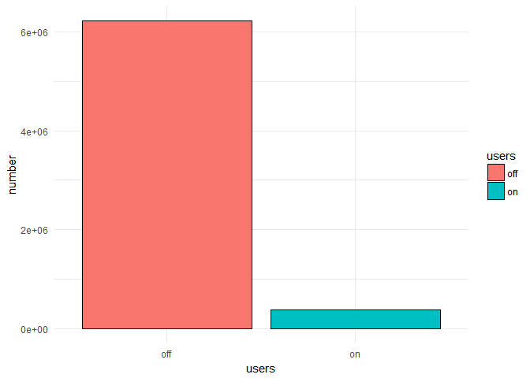
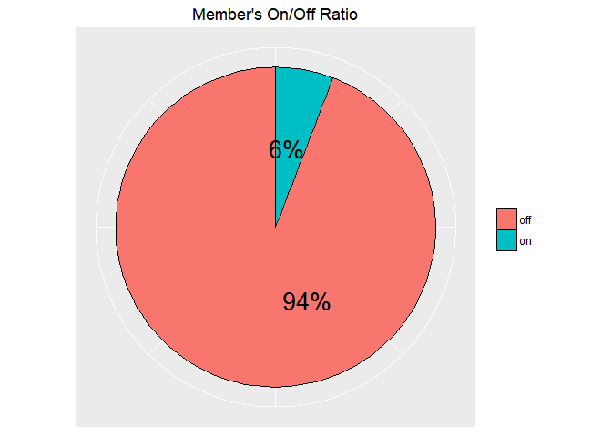
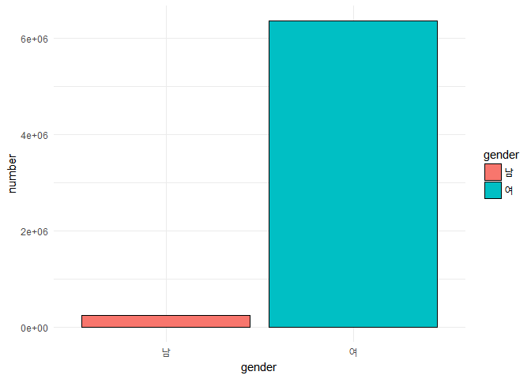
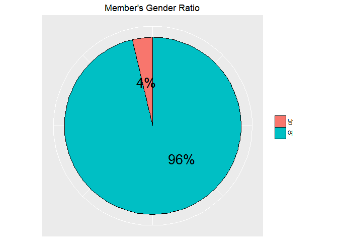
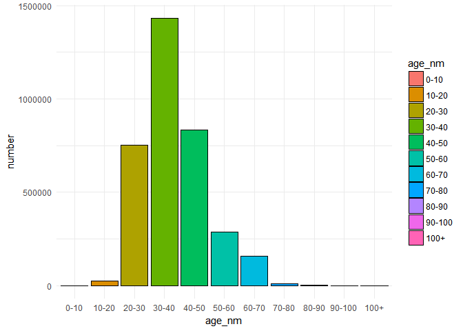

pjt\_rfm\_total\_file\_comment\_2(Data\_EDA\_1)
================
TEAM\_1
2018년 10월 9일

-   RDate를 loading하고 이를 이용해 간단한 data EDA를 해보도록 한다.

``` r
load('./data/cust_prod_total_raw.RData'); head(cust_prod_total) # 데이터 loading
```

    ##    V1     date      custid grade prod_code on_off qty   amt sex age
    ## 1:  1 20160101 60000215450  club     94266    off   1 39000  여  30
    ## 2:  2 20160101 60000215450  club    891017    off   1  1500  여  30
    ## 3:  3 20160101 60000315908  club     95017    off   1 28000  여  50
    ## 4:  4 20160101 60000613827  club     98061    off   1 15500  여  30
    ## 5:  5 20160101 60000634761  club     82478    off   1     0  여  30
    ## 6:  6 20160101 60000863294  club     24728    off   1 24600  여  30
    ##                 prod_nm cate      cate_ftn        cate_line
    ## 1:     SW AFR BODY BALM Body   Body_Butter SPA OF THE WORLD
    ## 2:  SPA HEART BOX-BROWN  ETC           ETC             NONE
    ## 3:    WHITE/M LIBER B/B Body   Body_Butter WHITE MUSK LIBER
    ## 4:     MORINGA MILK B/L Body   Body_Lotion          MORINGA
    ## 5: WHITE/M B/LOTION 400 Body   Body_Lotion       WHITE MUSK
    ## 6:  DOY EYE CONCENTRATE Skin Skin_Eyecream   DROPS OF YOUTH

회원등급에 대한 EDA
-------------------

-   먼저는 회원등급 분포에 대해 알아본다.
-   고객 grade에 분포에 대해 bar chart 와 pie chart를 이용 시각화 해 본다.

``` r
# bar chart
grade <- names(table(cust_prod_total$grade))
grade_num <- as.numeric(unname(table(cust_prod_total$grade))); grade_num
```

    ## [1] 1151429  427132 5027254

``` r
grade_df <- data.frame(grades = grade, number = grade_num)

ggplot(grade_df, aes(x=grades, y=number, fill=grades)) + 
  geom_bar(stat='identity', color='black') +
  scale_x_discrete(limits=names(table(cust_prod_total$grade))) +
  theme_minimal() 
```



``` r
## pie chart
grade_dfc <- grade_df %>%
  mutate(share = number/sum(number)*100.0) %>%
  arrange(desc(number))

ggplot(grade_dfc, aes("", share, fill = grades)) +
  geom_bar(width = 1, size = .2, stat = "identity", color='black') +
  coord_polar("y") +
  geom_text(aes(label = paste0(round(share), "%")), 
            position = position_stack(vjust = 0.4), size=7) +
  labs(x = NULL, y = NULL, fill = NULL, title = "Membership Grades Ratio") +
  theme(axis.line = element_blank(),
        axis.text = element_blank(),
        axis.ticks = element_blank(),
        plot.title = element_text(hjust = 0.5, color = "black"))
```



-   `love` 등급에서 `club` 등급이 되기 위해서는 연간 20만원 이상 구매해야 한다.
-   `club` 등급에서 `gold` 등급이 되기 위해서는 연간 6회이상 방문하고 60만원 이상 구매해야 한다.
-   위의 두 시각화 결과를 보면 지나치게 `love` 등급이 높게 편중되어 있음을 알 수 있다.
-   `love` 등급이 그 상위 등급인 `club` 등급으로 등급상승이 잘 이루어지지 않고 있어 충성 고객집단이 될 기회가 적다는 것이 A샵 회사의 큰 문제가 될 수 있다. 이를 해결하기 위한 방법에 대한 연구가 본 프로젝트의 큰 주제가 될 것이다. 일단 등급을 세분화하여 `love +` 등급을 생성하고 `love` 등급의 고객들을 `love +` 으로 올리는 마케팅 전략의 도입방안도 고려할 필요가 있다고 생각한다.

구매채널 온/오프라인에 대한 EDA
-------------------------------

``` r
cust_prod_total$on_off <- as.factor(cust_prod_total$on_off)
summary(cust_prod_total$on_off) 
```

    ##     off      on 
    ## 6219970  385845

-   오프라인과 온라인 구매 비율에 대한 분포를 bar chart와 pie chart를 이용하여 시각화 해본다.

``` r
# bar chart
users<- names(table(cust_prod_total$on_off))
users_num <- as.numeric(unname(table(cust_prod_total$on_off))) 
users_df <- data.frame(users = users, number = users_num)

ggplot(users_df, aes(x=users, y=number, fill=users)) + 
  geom_bar(stat='identity', color='black') +
  scale_x_discrete(limits=names(table(cust_prod_total$on_off))) +
  theme_minimal()
```



``` r
## pie chart
users_dfc <- users_df %>%
  mutate(share = number/sum(number)*100.0) %>%
  arrange(desc(number))

ggplot(users_dfc, aes("", share, fill = users)) +
  geom_bar(width = 1, size = .2, stat = "identity", color='black') +
  coord_polar("y") +
  geom_text(aes(label = paste0(round(share), "%")), 
            position = position_stack(vjust = 0.4), size=7) +
  labs(x = NULL, y = NULL, fill = NULL, title = "Member's On/Off Ratio") +
  theme(axis.line = element_blank(),
        axis.text = element_blank(),
        axis.ticks = element_blank(),
        plot.title = element_text(hjust = 0.5, color = "black"))
```



-   위의 시각화 결과를 보면 오프라인 구매가 온라인 구매보다 월등히 많음을 알 수 있다. 하지만 여기서의 온라인 구매이력은 오로지 A샵 홈페이지를 통해 구매한 거래내역만이 있는 것으로 홈페이지가 아닌 다른 온라인 유통 채널(쿠팡 등)을 통한 거래는 포함되어 있지 않다.
-   구매의 트랜드가 오프라인에서 온라인으로 옮겨지고 있는데 온라인 구매이력을 모두 추적하고 분석할 수 없는 점은 추후 A샵의 데이터 분석을 이용한 마케팅 활동에 상당한 제한을 가할 수 있다.

성별에 대한 EDA
---------------

``` r
cust_prod_total$sex <- as.factor(cust_prod_total$sex)
summary(cust_prod_total$sex)
```

    ##      남      여    NA's 
    ##  245815 6359694     306

``` r
# bar chart
sex <- names(table(cust_prod_total$sex))
sex_num <- as.numeric(unname(table(cust_prod_total$sex)))
sex_df <- data.frame(gender = sex, number = sex_num)
ggplot(sex_df, aes(x=gender, y=number, fill=gender)) + 
  geom_bar(stat='identity', color='black') +
  scale_x_discrete(limits=names(table(cust_prod_total$sex))) +
  theme_minimal()
```



``` r
sex_dfc <- sex_df %>%
  mutate(share = number/sum(number)*100.0) %>%
  arrange(desc(number))

ggplot(sex_dfc, aes("", share, fill = gender)) +
  geom_bar(width = 1, size = .2, stat = "identity", color='black') +
  coord_polar("y") +
  geom_text(aes(label = paste0(round(share), "%")), 
            position = position_stack(vjust = 0.4), size=7) +
  labs(x = NULL, y = NULL, fill = NULL, title = "Member's Gender Ratio") +
  theme(axis.line = element_blank(),
        axis.text = element_blank(),
        axis.ticks = element_blank(),
        plot.title = element_text(hjust = 0.5, color = "black"))
```



-   여성에 대한 비율이 압도적으로 많다. 남성 고객들의 유치가 아쉬운 부분이라 할 수 있는데 이를 위한 장기적 관점의 전략검토가 필요할 수 있다.

연령대에 대한 EDA
-----------------

``` r
cust_prod_total$age <- as.factor(cust_prod_total$age)
summary(cust_prod_total$age)
```

    ##       0      10     100      20      30      40      50      60      70 
    ##      11   25019      50  752121 1431202  835702  287489  159669   11956 
    ##      80      90    none    NA's 
    ##    1934     651 2771703  328308

-   `none`(227만) 혹은 `NA`(33만)로 되어있는 부분이 상당히 많다. 나이를 알리고 싶지 않은 고객들의 특성일까? 연령대별 주요 구매물품이 다를 수 있고 이는 향후 고객들에게 추천을 할 때 고려될 수 있는 변수가 될 수 있다. 연령대를 예측하는 모델을 ML을 통해 구현해 보는 것은 프로젝트의 소과제로 고려해 볼 수 있다.

-   고객 연령대 비율에 대한 분포를 bar chart를 이용하여 시각화 해본다.

``` r
age_table <- table(cust_prod_total$age)[1:11]
names(age_table) <-  c('0-10', '10-20', '100+', '20-30', '30-40', '40-50', 
                       '50-60', '60-70', '70-80', '80-90', '90-100')
age_table
```

    ##    0-10   10-20    100+   20-30   30-40   40-50   50-60   60-70   70-80 
    ##      11   25019      50  752121 1431202  835702  287489  159669   11956 
    ##   80-90  90-100 
    ##    1934     651

``` r
# bar chart
age_table <- table(cust_prod_total$age)[1:11]
names(age_table) <-  c('0-10', '10-20', '100+', '20-30', '30-40', '40-50', 
                       '50-60', '60-70', '70-80', '80-90', '90-100')
age <- names(age_table)
age_num <- as.numeric(unname(age_table))
age_df <- data.frame(age_nm = age, number = age_num)
age_df$age_nm <- factor(age_df$age_nm, levels=c("0-10", "10-20", "20-30", "30-40", "40-50",
                                                "50-60", "60-70", "70-80", "80-90", "90-100", "100+"))

age_df <- rbind(age_df[-3, ], age_df[3, ])

ggplot(age_df, aes(x=age_nm, y=number, fill=age_nm)) + 
  geom_bar(stat='identity', color='black') +
  scale_x_discrete(limits=age_df$age_nm) +
  theme_minimal()
```



-   `30-40대 > 40-50대 > 20-30대` 고객 순으로 고객들이 분포하고 있다.
-   왜 이러한 분포를 보이고 있을까? A샵 브랜드의 지속적인 성장을 위해서는 20-30대의 고객 유치가 시급해 보인다.(저가제품, 가성비 선호 등의 20-30대 소비성향이 반영되었을까요?)
