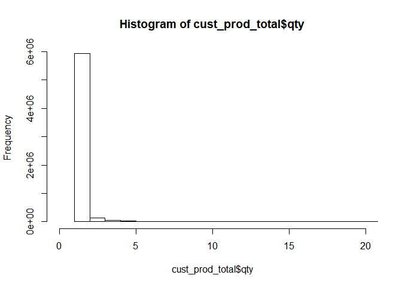
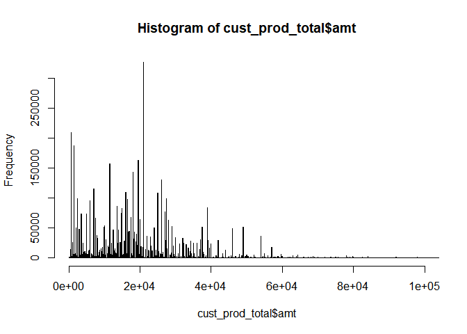

pjt\_rfm\_total\_file\_comment\_3(date\_calculation\_and\_generating\_new\_var)
================
TEAM\_1
2018년 10월 9일

날짜 연산
---------

-   구매요일 분포확인, 고객별 최근 혹은 최초 구매일 등 데이터의 날짜를 연산해야 할 경우가 많이 있다. 이를 위해 날짜에 관한 변수를 생성해본다.

-   일단 RDate를 loading한다.

``` r
load('./data/cust_prod_total_raw.RData'); head(cust_prod_total) # 데이터 loading
```

    ##    V1     date      custid grade prod_code on_off qty   amt sex age
    ## 1:  1 20160101 60000215450  club     94266    off   1 39000  여  30
    ## 2:  2 20160101 60000215450  club    891017    off   1  1500  여  30
    ## 3:  3 20160101 60000315908  club     95017    off   1 28000  여  50
    ## 4:  4 20160101 60000613827  club     98061    off   1 15500  여  30
    ## 5:  5 20160101 60000634761  club     82478    off   1     0  여  30
    ## 6:  6 20160101 60000863294  club     24728    off   1 24600  여  30
    ##                 prod_nm cate      cate_ftn        cate_line
    ## 1:     SW AFR BODY BALM Body   Body_Butter SPA OF THE WORLD
    ## 2:  SPA HEART BOX-BROWN  ETC           ETC             NONE
    ## 3:    WHITE/M LIBER B/B Body   Body_Butter WHITE MUSK LIBER
    ## 4:     MORINGA MILK B/L Body   Body_Lotion          MORINGA
    ## 5: WHITE/M B/LOTION 400 Body   Body_Lotion       WHITE MUSK
    ## 6:  DOY EYE CONCENTRATE Skin Skin_Eyecream   DROPS OF YOUTH

-   날짜에 대한 데이터 형식을 확인해 보면 `<int>` 형임을 알 수 있다. 날짜 연산을 위해서는 시간에 대한 정보를 담고 있는 시간자료형으로 데이터를 변환해야 한다. 먼저는 숫자를 `<chr>`형으로 바꾸고 바뀌어진 결과를 `as.POSIXct()` 함수를 통해 시간자료형으로 변환한다.

-   `as.POSIXct()`를 통해 변환된 시간자료형 자료에는 시간에 대한 많은 정보가 포함된다. 윤년, 윤초, 일광절약시간(summer time), 표준시간대, 요일 등이 그것이다. 단순 `<chr>` 형식의 객체에 이러한 정보를 담기 위해서는 연산에 많은 시간이 소요됨에 유의해야 한다.

``` r
cust_prod_total$date <- as.POSIXct(as.character(cust_prod_total$date), format="%Y%m%d")
```

-   한편, 위의 출력결과에서 `prod_code` 또한 `<int>` 형인데 prod\_code는 특정 물품을 mapping한 고유한 값(일종의 고유명사)이므로 추후 분석을 위해 `<chr>` 형으로 변환한다.

``` r
cust_prod_total$prod_code <- as.character(cust_prod_total$prod_code)
```

-   날짜 연산에 주로 활용하는 R 패키지는 `lubridate package`이다.
-   `lubridate package`는 `xts`,`zoo`와 함께 R의 대표적인 고수준 날짜/시간 패키지이다.
-   한편, 요일 변수를 영어로 만들기 위해 R의 `Locale`을 영문 `Locale`로 잠시 전환한다.(요일 변수 생성 후 다시 `Locale`을 한글로 전환한다.) 보통 한글 윈도우의 경우 `Locale Time`이 `Korean_Korea.949`로 설정되어 있는데 이를 잠시 요일 변수를 생성하는 동안만 `English_United States.1252`로 변환해 두는 것이다. 데이터를 영문으로 만드는 이유는 추후 encoding 깨짐 현상 등 에러를 덜 발생시키기 때문이다.

``` r
Sys.setlocale("LC_TIME", "English_United States.1252") # Windows
```

    ## [1] "English_United States.1252"

``` r
# Sys.setlocale("LC_TIME", "en_US.UTF-8") # Mac
```

-   추후 활용을 위해 year, month, day, weekday 변수를 각각 생성한다.

``` r
# 날짜를 한번에 연/월/일 나누기 
# https://cran.r-project.org/web/packages/lubridate/vignettes/lubridate.html
cust_prod_total <- cust_prod_total %>%
  mutate(year = lubridate::year(date), 
         month = lubridate::month(date), 
         day = lubridate::day(date),
         weekday = lubridate::wday(date, label = TRUE))
```

-   정제된 데이터를 확인한다.

``` r
glimpse(cust_prod_total)
```

    ## Observations: 6,605,815
    ## Variables: 18
    ## $ V1        <int> 1, 2, 3, 4, 5, 6, 7, 8, 9, 10, 11, 12, 13, 14, 15, 1...
    ## $ date      <dttm> 2016-01-01, 2016-01-01, 2016-01-01, 2016-01-01, 201...
    ## $ custid    <chr> "60000215450", "60000215450", "60000315908", "600006...
    ## $ grade     <chr> "club", "club", "club", "club", "club", "club", "clu...
    ## $ prod_code <chr> "94266", "891017", "95017", "98061", "82478", "24728...
    ## $ on_off    <chr> "off", "off", "off", "off", "off", "off", "off", "of...
    ## $ qty       <int> 1, 1, 1, 1, 1, 1, 1, 1, 1, 1, 1, 1, 2, 1, 1, 1, 1, 1...
    ## $ amt       <dbl> 39000, 1500, 28000, 15500, 0, 24600, 36000, 8000, 70...
    ## $ sex       <chr> "여", "여", "여", "여", "여", "여", "여", "여", "여", "여", "여...
    ## $ age       <chr> "30", "30", "50", "30", "30", "30", "30", "20", "20"...
    ## $ prod_nm   <chr> "SW AFR BODY BALM", "SPA HEART BOX-BROWN", "WHITE/M ...
    ## $ cate      <chr> "Body", "ETC", "Body", "Body", "Body", "Skin", "Skin...
    ## $ cate_ftn  <chr> "Body_Butter", "ETC", "Body_Butter", "Body_Lotion", ...
    ## $ cate_line <chr> "SPA OF THE WORLD", "NONE", "WHITE MUSK LIBER", "MOR...
    ## $ year      <dbl> 2016, 2016, 2016, 2016, 2016, 2016, 2016, 2016, 2016...
    ## $ month     <dbl> 1, 1, 1, 1, 1, 1, 1, 1, 1, 1, 1, 1, 1, 1, 1, 1, 1, 1...
    ## $ day       <int> 1, 1, 1, 1, 1, 1, 1, 1, 1, 1, 1, 1, 1, 1, 1, 1, 1, 1...
    ## $ weekday   <ord> Fri, Fri, Fri, Fri, Fri, Fri, Fri, Fri, Fri, Fri, Fr...

-   위 출력결과를 살펴보면 date는 시간자료형 dttm, prod\_code는 <chr> 형으로 변환되었음을 확인할 수 있다.
-   year, month, day, weekday 변수가 생성되었으며 특히 weekday 변수가 영문으로 생성된 것을 확인할 수 있다.
-   요일 변수 생성을 마쳤으므로 다시 Locale을 한글로 전환한다.

``` r
Sys.setlocale("LC_TIME", "Korean_Korea.949") # Windows
```

    ## [1] "Korean_Korea.949"

``` r
# Sys.setlocale("LC_TIME", "ko_KR.UTF-8") # Mac
```

이상치 제거(Remove Ouliers)
---------------------------

### 수량(qty)에 대한 이상치

``` r
range(cust_prod_total$qty) 
```

    ## [1] -200 1900

-   수량이란 한 거래에서 하나의 품목이 판매된 수량인데 이것이 음수가 나온다는 것은 반품되었다는 의미일 것이다. 이런 구매내역은 분석에 불필요하므로 `qty < 0` 인 경우는 `NA` 처리하여 분석에서 제외한다.

``` r
cust_prod_total <- cust_prod_total %>% 
  mutate(qty = replace(qty, qty<=0, NA)) %>%
  drop_na()

nrow(cust_prod_total)
```

    ## [1] 6191862

-   총 6,605,815 건의 거래 데이터에서 `qty < 0` 인 경우를 제외할 경우, 데이터가 6,191,862으로 감소되었음에 유의할 필요가 있다.

``` r
range(cust_prod_total$qty) 
```

    ## [1]    1 1900

-   qty가 1900개라는 것은 한 번에 같은 물품을 1,900개 구매한 사례가 있다는 것이다. 이런 구매는 개인의 일반적인 구매가 아닌 기업간 거래에서 발생하는 경우라 할 수 있어 분석에서 제외할 필요가 있다. 이상치에 대한 제거 부분은 추후 amt 이상치를 제거하면 함께 고려할 것이므로 여기서는 직접 제외시키지 않고 다만 qtyd에 대한 이상치가 있다는 것만을 인지하는 것으로만 한다.

-   qty에 대한 히스토그램은 다음과 같다.

``` r
hist(cust_prod_total$qty, xlim=c(0,20), breaks = 1500)
```



### 구매액(amt)에 대한 이상치

``` r
range(cust_prod_total$amt)
```

    ## [1]   -39200 29232000

-   amt 변수의 정확한 정의를 알고 있는 것이 중요하다고 생각한다. amt는 한 거래에서 품목별로 지불된 금액을 의미한다. 즉 장바구니 별 총 지출금액이 아니며, 한 장바구니에 포함된 한 종류의 품목에서 지출된 총 금액이라 할 수 있다. 이는 데이터의 한 row가 물품을 date, custid, prod\_code를 중심으로 기록되어져 있기 때이다. 예를 들면, 한 고객이 장바구니 1만원짜리 샴푸 2개를 사고 5천원짜리 비누를 샀다면, amt는 각각 2만원과 5천원이 된다.

-   위의 경우처럼 `amt < 0` 인 경우는 반품, 환불 등의 의미이므로 `NA` 처리하여 분석에서 제외한다.

``` r
cust_prod_total <- cust_prod_total %>% 
  mutate(amt = replace(amt, amt<=0, NA)) %>%
  drop_na()

nrow(cust_prod_total)
```

    ## [1] 6085002

-   6,191,862 건의 데이터가 6,085,002 건으로 감소되었음에 유의할 필요가 있다.
-   amt에 대한 히스토그램은 다음과 같다. 10만원 이상의 거래는 매우 드물다.

``` r
hist(cust_prod_total$amt, breaks = 1000000, xlim=c(0,100000))
```



-   한편, 데이터에 있는 qty 변수와 amt 변수를 이용해 물품당 단가를 계산하여 price 변수를 생성한다. 즉 `price = (qty/amt)`

``` r
cust_prod_total <- cust_prod_total %>% 
  mutate(price = amt / qty)
```

### Frequency

-   Frequency를 정의 하는 것은 분석가의 role이다.
-   이번 프로젝트에서는 고객의 매장 혹은 온라인 사이트 방문 횟수로 정의하여 진행한다.
-   즉, 하루에 여러 물품을 다수 구매하였더라도 하루에 한 번 거래한 것으로 가정한다.
-   이렇게 정한 이유는 도메인 전문가의 조언(요청?) 때문이다.
-   이런 Frequency를 정의하는 코드는 다음과 같다.

``` r
userF <- cust_prod_total %>%
  group_by(custid) %>%
  summarize(frequency=n_distinct(date))
```

``` r
range(userF$frequency)
```

    ## [1]   1 395

-   frequency의 최대값이 395번인데 정말 2년 6개월간 395번 방문한 고객이 있다는 것은 상상하기 어렵다. 이는 매장 직원이 자신의 포인트 적립을 위해 다른 고객이 구매한 내용의 포인트를 적립했기에 발생한 일일 것이다.

``` r
userF %>% filter(frequency >= 100) %>% nrow
```

    ## [1] 14

``` r
userF %>% filter(frequency >= 50) %>% nrow
```

    ## [1] 195

``` r
userF %>% filter(frequency >= 30) %>% nrow
```

    ## [1] 1174

``` r
userF %>% filter(frequency >= 15) %>% nrow
```

    ## [1] 8886

-   100번 이상 방문한 고객은 14명, 50번 이상 방문한 고객은 195명, 30번 이상 방문하 고객은 1,174명, 15명 이상 방문한 고객은 8,886명이다.

-   1년에 6번 구매가 gold 등급 유지 기준이다. 2년 6월 동안에 15번 방문하면 이디 gold 등급을 유지할 수 있다. 15번 이상 방문한 고객이라면 정상적으로 방문한 일반 고객이라기 보다는 매장 직원에 의한 포인트 적입일 가능성이 크다. 그러므로 15번 이상 방문한 고객에 대한 데이터를 이상치로 가정하고 분석에서 제외한다.

-   이렇게 제외시키더라도 총 8,886명이 분석에서 제외되며 이는 전체 고객수에 약 .7%애 불과하다.

### Monetary

-   100만원 이상은 일반적으로 기업특판으로 판매되는 경우(노동절 선물, 창립기념 등)이거나 개인특판(경조사, 돌잔치, 답례품 등)의 주문건에 해당된다. 이는 고객분석에 적합한 거래 데이터가 아니며 분석에서 제외한다.엠

-   일별 구매금액이 100만원 이상인 주문건을 제거한 데이터를 `cust_prod_total_fix` 변수명으로 저장한다.

``` r
## 일별 구매금액이 100만원 이상인 주문건 제거
cust_prod_total_fix <- cust_prod_total %>%
  group_by(custid, date) %>%
  mutate(sum_day_amt = sum(amt)) %>%
  filter(sum_day_amt < 1000000) 
(nrow(cust_prod_total) - nrow(cust_prod_total_fix)) / nrow(cust_prod_total)
```

    ## [1] 0.01759276

``` r
# 0.01759276 : 전체의 1.8%
```

### 이상치 제거된 데이터 최종 생성하기

-   이상의 논의를 통해 도출된 이상치 제거 기준이 적용된 데이터를 새로 작성한다.
-   먼저는 일별 구매금 100만원 이상이 주문건을 제외한 데이터에서 2년 6개월간 고객별 구매 횟수를 계산하여 `cust_prod_total_fix_1` 변수에 저장한다.

``` r
cust_prod_total_fix_1 <- cust_prod_total_fix %>%
  group_by(custid) %>%
  mutate(frequency=n_distinct(date))
```

-   `cust_prod_total_fix_1`에서 `frequency`가 15이상인 데이터를 제외시키고 이를 cust\_prod\_total\_fix\_2 변수에 저장한다.

``` r
cust_prod_total_fix_2 <- cust_prod_total_fix_1 %>%
  filter(frequency < 15)
(nrow(cust_prod_total) - nrow(cust_prod_total_fix_2)) / nrow(cust_prod_total)
```

    ## [1] 0.1107911

-   이렇게 최종 생산된 cust\_prod\_total\_fix\_2 변수명의 데이터를 cust\_prod\_total.RData 로 변환하여 추후 분석에 활용한다.

``` r
save(cust_prod_total_fix_2, file="cust_prod_total.RData")
```

-   이렿게 저장된 `.RData` 파일은 다음과 같이 작업중인 R Session 내 전역변수로 loading 할 수 있다. 이 때의 변수 명칭은 `cust_prod_total_fix_2`이다.

``` r
load('./data/cust_prod_total.RData'); head(cust_prod_total_fix_2)
```

    ## # A tibble: 6 x 21
    ## # Groups:   custid [4]
    ##      V1 date                custid     grade prod_code on_off   qty    amt
    ##   <int> <dttm>              <chr>      <chr> <chr>     <chr>  <int>  <dbl>
    ## 1     1 2016-01-01 00:00:00 600002154~ club  94266     off        1 39000.
    ## 2     2 2016-01-01 00:00:00 600002154~ club  891017    off        1  1500.
    ## 3     3 2016-01-01 00:00:00 600003159~ club  95017     off        1 28000.
    ## 4     4 2016-01-01 00:00:00 600006138~ club  98061     off        1 15500.
    ## 5     6 2016-01-01 00:00:00 600008632~ club  24728     off        1 24600.
    ## 6     7 2016-01-01 00:00:00 600008632~ club  25278     off        1 36000.
    ## # ... with 13 more variables: sex <chr>, age <chr>, prod_nm <chr>,
    ## #   cate <chr>, cate_ftn <chr>, cate_line <chr>, year <dbl>, month <dbl>,
    ## #   day <int>, weekday <ord>, price <dbl>, sum_day_amt <dbl>,
    ## #   frequency <int>
