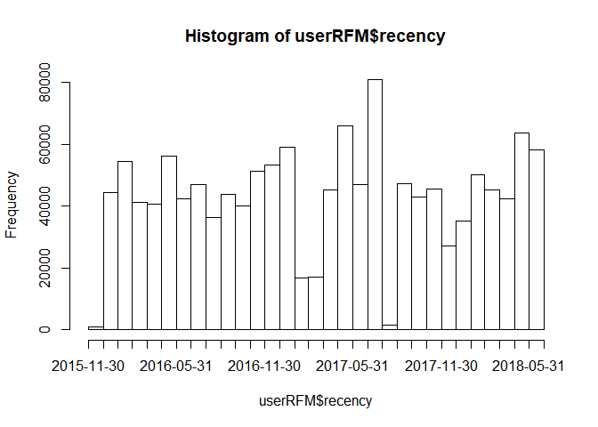
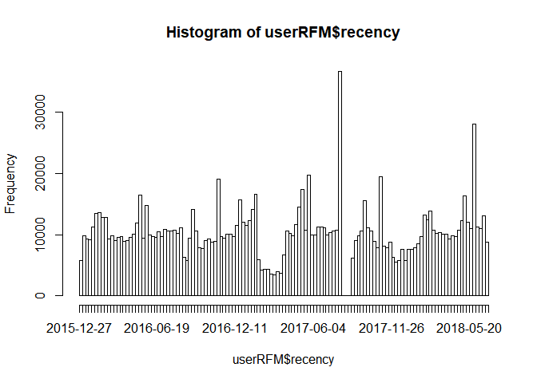
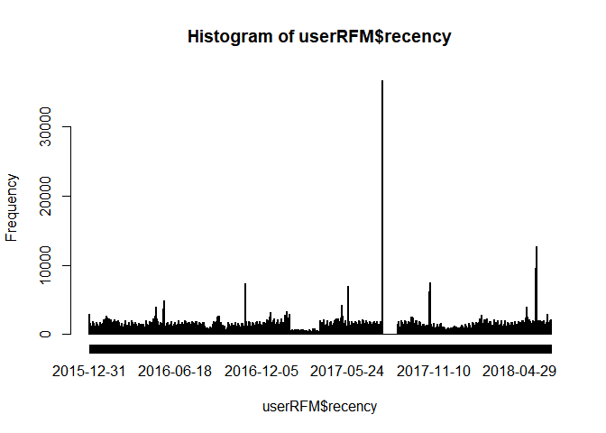
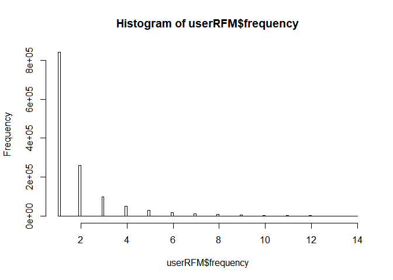
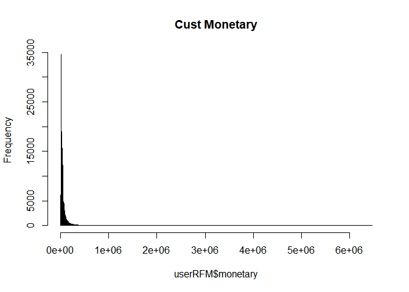
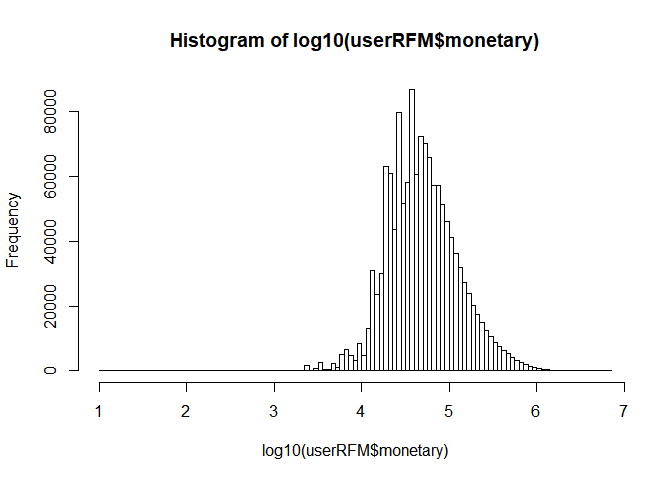
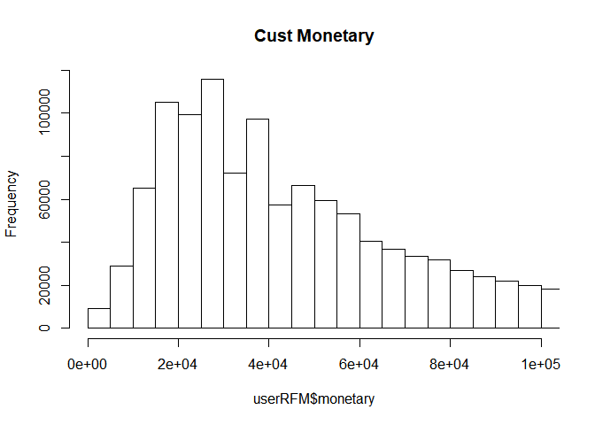
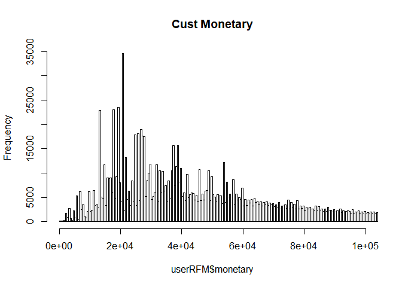
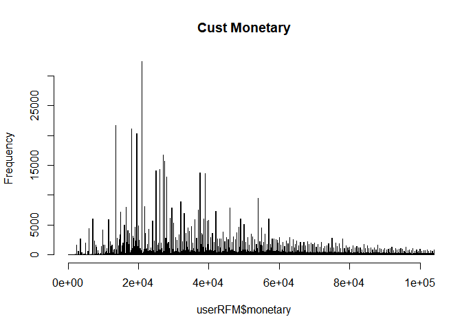

pjt\_rfm\_total\_file\_comment\_4(userRFM\_data)
================
TEAM\_1
2018년 10월 9일

userRFM 데이터 생성
-------------------

-   먼저 cust\_prod\_total\_fix\_2 데이터를 loading 한다.

``` r
load('cust_prod_total.RData'); head(cust_prod_total_fix_2)
```

    ## # A tibble: 6 x 21
    ## # Groups:   custid [4]
    ##      V1 date                custid     grade prod_code on_off   qty    amt
    ##   <int> <dttm>              <chr>      <chr> <chr>     <chr>  <int>  <dbl>
    ## 1     1 2016-01-01 00:00:00 600002154~ club  94266     off        1 39000.
    ## 2     2 2016-01-01 00:00:00 600002154~ club  891017    off        1  1500.
    ## 3     3 2016-01-01 00:00:00 600003159~ club  95017     off        1 28000.
    ## 4     4 2016-01-01 00:00:00 600006138~ club  98061     off        1 15500.
    ## 5     6 2016-01-01 00:00:00 600008632~ club  24728     off        1 24600.
    ## 6     7 2016-01-01 00:00:00 600008632~ club  25278     off        1 36000.
    ## # ... with 13 more variables: sex <chr>, age <chr>, prod_nm <chr>,
    ## #   cate <chr>, cate_ftn <chr>, cate_line <chr>, year <dbl>, month <dbl>,
    ## #   day <int>, weekday <ord>, price <dbl>, sum_day_amt <dbl>,
    ## #   frequency <int>

``` r
dim(cust_prod_total_fix_2)
```

    ## [1] 5410838      21

-   userRFM 변수를 다음과 같이 생성한다.

``` r
userRFM <- cust_prod_total_fix_2 %>% 
  group_by(custid) %>% # 고객별 
  dplyr::summarize(minRecency=min(date), # 최초 구매일
                   recency=max(date),    # 최근 구매일
                   monetary=sum(amt), # 총구매액
                   frequency=min(frequency), ### 에러 수정 (값 안들어감)
                   
                   period=as.numeric(max(date)-min(date))) # 방문 최대 텀
```

``` r
glimpse(userRFM)
```

    ## Observations: 1,344,345
    ## Variables: 6
    ## $ custid     <chr> "6.", "6.200565840130833", "6.200565840131470", "6....
    ## $ minRecency <dttm> 2016-05-23, 2016-02-27, 2018-06-30, 2016-10-08, 20...
    ## $ recency    <dttm> 2018-05-15, 2017-03-17, 2018-06-30, 2016-10-08, 20...
    ## $ monetary   <dbl> 63900, 116500, 19200, 28000, 46400, 29500, 279000, ...
    ## $ frequency  <dbl> 2, 2, 1, 1, 1, 1, 6, 1, 1, 2, 1, 4, 1, 1, 1, 1, 1, ...
    ## $ period     <dbl> 722, 384, 0, 0, 0, 0, 322, 0, 0, 64, 0, 269, 0, 0, ...

-   분석 대상이 되는 고객의 수는 1,344,345명이다.

-   추후 날짜 계산을 위해 minDate, maxDate 변수를 생성한다.
-   minDate, maxDate는 Unix Timestamp로서 1970-01-01 00:00:00으로부터 경과시간을 초로 환산하여 정수로 나타낸 것이다.
-   Unix Timestamp를 활용하면 시간 연산을 매우 빠르게 수행할 수 있다.

``` r
userRFM$minDate <- as.numeric(as.POSIXct(userRFM$minRecency, origin="1970-01-01"))
userRFM$maxDate <- as.numeric(as.POSIXct(userRFM$recency, origin="1970-01-01"))
```

``` r
glimpse(userRFM)
```

    ## Observations: 1,344,345
    ## Variables: 8
    ## $ custid     <chr> "6.", "6.200565840130833", "6.200565840131470", "6....
    ## $ minRecency <dttm> 2016-05-23, 2016-02-27, 2018-06-30, 2016-10-08, 20...
    ## $ recency    <dttm> 2018-05-15, 2017-03-17, 2018-06-30, 2016-10-08, 20...
    ## $ monetary   <dbl> 63900, 116500, 19200, 28000, 46400, 29500, 279000, ...
    ## $ frequency  <dbl> 2, 2, 1, 1, 1, 1, 6, 1, 1, 2, 1, 4, 1, 1, 1, 1, 1, ...
    ## $ period     <dbl> 722, 384, 0, 0, 0, 0, 322, 0, 0, 64, 0, 269, 0, 0, ...
    ## $ minDate    <dbl> 1463929200, 1456498800, 1530284400, 1475852400, 152...
    ## $ maxDate    <dbl> 1526310000, 1489676400, 1530284400, 1475852400, 152...

### Recency에 대한 EDA

-   고객의 최근 방문일에 대한 EDA를 위해 recency의 데이터형을 <dttm> 에서 <date>으로 변환한다.

``` r
userRFM$recency <- as.Date(userRFM$recency, origin="1970-01-01")
head(userRFM$recency)
```

    ## [1] "2018-05-14" "2017-03-16" "2018-06-29" "2016-10-07" "2018-06-06"
    ## [6] "2016-12-03"

``` r
summary(userRFM$recency)
```

    ##         Min.      1st Qu.       Median         Mean      3rd Qu. 
    ## "2015-12-31" "2016-08-06" "2017-04-19" "2017-04-03" "2017-11-18" 
    ##         Max. 
    ## "2018-06-29"

-   월별 고객들의 최근 방문일에 대한 histogram은 다음과 같다.

``` r
# 월별 고객들의 최근 방문일에 대한 histogram
hist(userRFM$recency, breaks='month', 
     xlab=deparse(substitute(userRFM$recency)), 
     start.on.monday = f, freq=T, format='%Y-%m-%d') 
```



-   주간별 고객들의 최근 방문일에 대한 histogram은 다음과 같다.

``` r
# 주간별 고객들의 최근 방문일에 대한 histogram
hist(userRFM$recency, breaks='weeks', 
     xlab=deparse(substitute(userRFM$recency)), 
     start.on.monday = F, freq=T, format='%Y-%m-%d') 
```



-   일자별 고객들의 최근 방문일에 대한 histogram은 다음과 같다.

``` r
hist(userRFM$recency, breaks='days', 
     xlab=deparse(substitute(userRFM$recency)), 
     start.on.monday = F, freq=T, format='%Y-%m-%d') 
```



### Frequency에 대한 EDA

-   고객의 매장 혹은 온라인 사이트 방문 횟수인 frequency를 histogram을 통해 시각화해본다.

``` r
hist(userRFM$frequency, breaks = 100)
```



-   1회 방문고객에 대한 비율은 62.4%이다.

``` r
freq_1 <- userRFM %>%
  filter(frequency == 1)

dim(freq_1) # 1회 구매 고객 839,364명 :: 전체의 46.1%
```

    ## [1] 839364      8

``` r
(839364 / 1344345) * 100 # 62.4%가 한 번만 방문
```

    ## [1] 62.43665

-   2회 방문고객에 대한 비율은 19.5%이다.

``` r
freq_2 <- userRFM %>%
  filter(frequency == 2)
dim(freq_2) # 2번 구매 고객 261,949명
```

    ## [1] 261949      8

``` r
(261949 / 1344345) * 100 # 19.5%가 2번 방문
```

    ## [1] 19.48525

-   3회 방문고객에 대한 비율은 7.5%이다.

``` r
freq_3 <- userRFM %>%
  filter(frequency == 3)
dim(freq_3) # 3번 구매 고객 101,101명
```

    ## [1] 101101      8

``` r
(101101 / 1344345) * 100 # 7.5%가 3번 방문
```

    ## [1] 7.520465

-   4회 방문고객에 대한 비율은 3.8%이다.

``` r
freq_4 <- userRFM %>%
  filter(frequency == 4)
dim(freq_4) # 4번 이상 구매 고객 141,931명
```

    ## [1] 51439     8

``` r
(51439 / 1344345) * 100 # 10.6%가 4번 이상 방문
```

    ## [1] 3.826324

### Monetary에 대한 EDA

``` r
range(userRFM$monetary) # 10 ~ 6,457,720
```

    ## [1]      10 6457720

``` r
summary(userRFM$monetary) # medeian 4만7천원, mean 약 7만9천원
```

    ##    Min. 1st Qu.  Median    Mean 3rd Qu.    Max. 
    ##      10   27000   47000   78962   87000 6457720

``` r
hist(userRFM$monetary, breaks=10000, main='Cust Monetary')
```



-   로그를 취하면 보다 분석의 용이한 형태로 변환할 수 있다.

``` r
hist(log10(userRFM$monetary), breaks=100)
```



-   10만원 이상 구매하는 고객이 희박하므로 10만원 이하 부분에 대해 histogram을 그려본다.

``` r
hist(userRFM$monetary, breaks=2000, main='Cust Monetary', 
     xlim = c(0,100000))
```



``` r
hist(userRFM$monetary, breaks=20000, main='Cust Monetary', 
     xlim = c(0,100000))
```



``` r
hist(userRFM$monetary, breaks=100000, main='Cust Monetary', 
     xlim = c(0,100000))
```



-   특별히 많이 구매되어지는 부분은 2만원대 전후이며 1만원대 전후, 3만원대 전후, 4만원대 전후, 5만원대 전후로 구매하는 경우가 많음을 알 수 있다.

-   추후 정확한 peak 저점을 찾아 해당 지점들을 기준으로 구간을 나누어 M 점수를 산출할 필요가 있을 것이다.

### RFM별 상위 20%가 차지하는 총 매출액 대비 비중

-   R 분위수를 생성한다. 2018-01-26이 분위수 80%가 되는 일자이다.

``` r
# R : 최근방문 분위수 (날짜를 numeric으로 바꾸면 분위수 계산 가능)
quantR <- as.numeric(quantile(userRFM$maxDate,c(0,0.2,0.4,0.6,0.8,1)))
quantR[1]
```

    ## [1] 1451574000

``` r
quantR[5]
```

    ## [1] 1516892400

``` r
as.POSIXct(quantR[5], origin='1970-01-01') # R 분위수가 0.8이 되는 일자는 "2018-01-26" 
```

    ## [1] "2018-01-26 KST"

-   F 분위수를 생성한다. F 분위수 80%가 되는 곳의 값이 2이다.

``` r
# F : 빈도 분위수 
quantF <- quantile(userRFM$frequency, c(0,0.2,0.4,0.6,0.8,1))
quantF
```

    ##   0%  20%  40%  60%  80% 100% 
    ##    1    1    1    1    2   14

``` r
quantF[5] # F 분위수가 0.8이 되는 횟수는 "2"회
```

    ## 80% 
    ##   2

-   M 분위수를 생성한다. M 분위수 80%가 되는 곳의 값은 103,000이다.

``` r
# M : 구매액 분위수
quantM <- quantile(userRFM$monetary, c(0,0.2,0.4,0.6,0.8,1))
quantM
```

    ##      0%     20%     40%     60%     80%    100% 
    ##      10   22950   37500   58000  103000 6457720

``` r
quantM[5] # M 분위수가 0.8이 되는 액수는 "103,000" 원
```

    ##    80% 
    ## 103000

### RFM별 상위 20%가 차지하는 총 매출액 대비 비중

``` r
sumR <- sum(userRFM$monetary[userRFM$maxDate >= quantR[5]])
sumR / sum(userRFM$monetary) # 33.7%
```

    ## [1] 0.3366319

``` r
sumF <- sum(userRFM$monetary[userRFM$frequency >= quantF[5]])
sumF / sum(userRFM$monetary) # 68%
```

    ## [1] 0.6795547

``` r
sumM <- sum(userRFM$monetary[userRFM$monetary >= quantM[5]])
sumM / sum(userRFM$monetary) # 57%
```

    ## [1] 0.5701769

### RFM 가중치(weight) 계산하기

``` r
# (RFM지수 = weightR * Recency + weightF * Frequency + weightM * Monetary)
weightR <- sumR/(sumR + sumF + sumM)
weightF <- sumF/(sumR + sumF + sumM)
weightM <- sumM/(sumR + sumF + sumM)
```

``` r
weightR # 0.2122
```

    ## [1] 0.2122035

``` r
weightF # 0.4283
```

    ## [1] 0.4283726

``` r
weightM # 0.3594
```

    ## [1] 0.3594238

등급 부여 함수 제작하기
-----------------------

-data.table을 이용하여 시간을 단축한다.

``` r
intervalGrade <- function(mainData, fileName, rfmName, quantileData) {
  results <- rep (0, nrow(mainData))
  dataSource <- data.table(eval(parse(text=paste0(fileName,"$",rfmName))))
  for (i in 1:nrow(mainData)) {
    data = dataSource$V1[i]
    if (data >= quantileData[1] && data < quantileData[2] ) {
      results[i] <- 1
    } else if (data >= quantileData[2] && data < quantileData[3]) {
      results[i] <- 2
    } else if (data >= quantileData[3] && data < quantileData[4]) {
      results[i] <- 3
    } else if (data >= quantileData[4] && data < quantileData[5]) {
      results[i] <- 4
    } else { 
      results[i] <- 5 
    }
  }
  return(results)
}
```

RFM 점수 계산
-------------

### R 점수 계산(변수명 R에 할당)

-   반드시 숫자형 데이터인 maxDate에서 계산한다. <date> 형은 시간이 상당히 소요된다.

``` r
userRFM$R <- intervalGrade(userRFM, "userRFM", "maxDate", quantR) # 날짜 -> 숫자형 
```

### F 점수 계산(변수명 F에 할당)

``` r
userRFM$F <- intervalGrade(userRFM, "userRFM", "frequency", quantF)
```

### M 점수 계산(변수명 M에 할당)

``` r
userRFM$M <- intervalGrade(userRFM, "userRFM", "monetary", quantM)
```

### RFM Score 계산

-   5로 나누는 이유는? 80% 분위수와 상관이 있을 듯. 후술예정

``` r
# RFM지수 = weightR * Recency + weightF * Frequency + weightM * Monetary
userRFM$score <- (weightR * userRFM$R + weightF * userRFM$F + weightM * userRFM$M)*100/5
```

``` r
(quantS <- quantile(userRFM$score, c(0,0.2,0.4,0.6,0.8,1)))
```

    ##        0%       20%       40%       60%       80%      100% 
    ##  45.70236  57.13490  65.62305  75.75593  88.56745 100.00000

``` r
summary(userRFM$score)
```

    ##    Min. 1st Qu.  Median    Mean 3rd Qu.    Max. 
    ##   45.70   58.43   69.87   71.88   84.32  100.00

고객등급 분류 함수(finalGrade()) 제작
-------------------------------------

``` r
finalGrade <- function(mainData, fileName, rfmName, quantileData) {
  results <- rep (0, nrow(mainData))
  dataSource <- data.table(eval(parse(text=paste0(fileName,"$",rfmName))))
  for (i in 1:nrow(mainData)) {
    data = dataSource$V1[i]
    if (data >= quantileData[1] && data < quantileData[2] ) {
      results[i] <- "E"
    } else if (data >= quantileData[2] && data < quantileData[3]) {
      results[i] <- "D"
    } else if (data >= quantileData[3] && data < quantileData[4]) {
      results[i] <- "C"
    } else if (data >= quantileData[4] && data < quantileData[5]) {
      results[i] <- "B"
    } else { results[i] <- "A" }
  }
  
  return(results)
}
```

-   RFM 점수를 이용해 고객 등급을 분류한다.

``` r
userRFM$grade <- finalGrade(userRFM, "userRFM", "score", quantS)
```

``` r
userRFM$grade <- as.factor(userRFM$grade)
```

``` r
glimpse(userRFM)
```

    ## Observations: 1,344,345
    ## Variables: 13
    ## $ custid     <chr> "6.", "6.200565840130833", "6.200565840131470", "6....
    ## $ minRecency <dttm> 2016-05-23, 2016-02-27, 2018-06-30, 2016-10-08, 20...
    ## $ recency    <date> 2018-05-14, 2017-03-16, 2018-06-29, 2016-10-07, 20...
    ## $ monetary   <dbl> 63900, 116500, 19200, 28000, 46400, 29500, 279000, ...
    ## $ frequency  <dbl> 2, 2, 1, 1, 1, 1, 6, 1, 1, 2, 1, 4, 1, 1, 1, 1, 1, ...
    ## $ period     <dbl> 722, 384, 0, 0, 0, 0, 322, 0, 0, 64, 0, 269, 0, 0, ...
    ## $ minDate    <dbl> 1463929200, 1456498800, 1530284400, 1475852400, 152...
    ## $ maxDate    <dbl> 1526310000, 1489676400, 1530284400, 1475852400, 152...
    ## $ R          <dbl> 5, 3, 5, 2, 5, 2, 2, 3, 2, 2, 3, 3, 1, 3, 5, 5, 1, ...
    ## $ F          <dbl> 5, 5, 4, 4, 4, 4, 5, 4, 4, 5, 4, 5, 4, 4, 4, 4, 4, ...
    ## $ M          <dbl> 4, 5, 1, 2, 3, 2, 5, 2, 4, 3, 1, 4, 5, 5, 1, 2, 3, ...
    ## $ score      <dbl> 92.81152, 91.51186, 62.67864, 57.13490, 77.05559, 5...
    ## $ grade      <fct> A, A, D, D, B, D, B, D, C, C, E, B, C, B, D, C, D, ...
